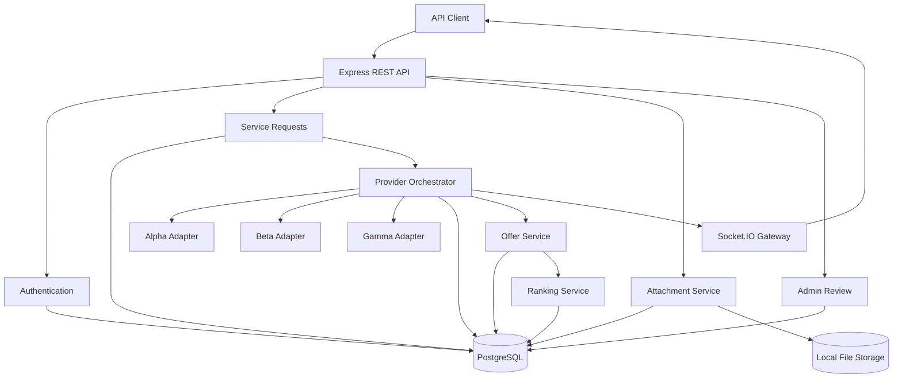

# Relay Backend

Backend API for Relay, a service-request orchestration platform that accepts customer requests, dispatches them to multiple providers, normalizes provider responses into a common offer model, ranks the resulting offers, and publishes request progress in real time.

The project is implemented as a backend-only service. It exposes REST APIs and Socket.IO events that can be consumed by web, mobile, or other API clients.

---

## Overview

Relay Backend demonstrates a production-oriented backend architecture for coordinating requests across multiple external providers.

The main workflow is:

1. A user registers or logs in.
2. The user creates a service request.
3. The request is persisted with idempotency protection.
4. The request is dispatched to multiple provider adapters.
5. Providers execute independently with timeout and retry handling.
6. Provider responses are normalized into a common internal offer model.
7. Successful offers are persisted and ranked.
8. Request status changes are published through Socket.IO.
9. Users can retrieve their requests and ranked offers.
10. Administrators can inspect requests, provider results, make controlled corrections, and review the audit trail.

The implementation focuses on:

- authentication and authorization;
- request idempotency;
- concurrent provider execution;
- partial failure tolerance;
- normalized provider integrations;
- deterministic offer ranking;
- secure attachment handling;
- realtime updates;
- admin authorization;
- auditability;
- automated testing.

---

## Technology Stack

### Runtime and API

- Node.js
- TypeScript
- Express.js

### Database

- PostgreSQL
- TypeORM

### Authentication and Security

- JWT access tokens
- Refresh-token rotation
- bcrypt password hashing
- Helmet
- CORS
- API rate limiting
- Role-based authorization

### Validation

- Zod

### Realtime

- Socket.IO

### File Handling

- Multer
- Local filesystem storage abstraction

### API Documentation

- OpenAPI / Swagger
- Swagger UI

### Testing

- Jest
- Supertest
- ts-jest

### Development Infrastructure

- Docker
- Docker Compose

---

## Architecture



The system is organized around domain modules rather than placing all business logic inside controllers.

Controllers are responsible for HTTP concerns, while services contain business rules and repositories handle persistence through TypeORM.

Provider-specific behavior is isolated behind adapters, allowing the orchestration layer to work with a normalized provider interface rather than depending directly on provider-specific response formats.

---

## Core Flow

A typical service request follows this lifecycle:

```text
Authenticated User
       |
       v
POST /api/requests
       |
       v
Validate + Idempotency Check
       |
       v
Persist Service Request
       |
       v
Provider Orchestrator
       |
       +----------+----------+
       |          |          |
       v          v          v
     Alpha       Beta       Gamma
       |          |          |
       +----------+----------+
                  |
                  v
        Normalize Responses
                  |
                  v
          Persist Results
                  |
                  v
          Persist Offers
                  |
                  v
             Rank Offers
                  |
                  v
        Update Request Status
                  |
                  v
        Publish Realtime Event
                  |
                  v
GET /api/requests/:publicId/offers
```

Provider failures are isolated. One provider timing out or returning an invalid response does not automatically discard successful results from other providers.

---

## Project Structure

```text
relay-backend/
├── src/
│   ├── common/
│   │   ├── constants/
│   │   ├── errors/
│   │   ├── middleware/
│   │   ├── types/
│   │   └── utils/
│   │
│   ├── config/
│   │   ├── database.ts
│   │   ├── env.ts
│   │   └── swagger.ts
│   │
│   ├── database/
│   │   ├── migrations/
│   │   └── seeds/
│   │
│   ├── modules/
│   │   ├── admin/
│   │   ├── attachments/
│   │   ├── audit/
│   │   ├── auth/
│   │   ├── offers/
│   │   ├── providers/
│   │   │   ├── alpha/
│   │   │   ├── beta/
│   │   │   └── gamma/
│   │   ├── ranking/
│   │   ├── realtime/
│   │   ├── requests/
│   │   └── users/
│   │
│   ├── app.ts
│   └── server.ts
│
├── tests/
│   ├── integration/
│   └── unit/
│
├── storage/
│   └── attachments/
│
├── docker-compose.yml
├── package.json
├── tsconfig.json
└── README.md
```

---

# Project Setup

## Prerequisites

Before running the project, install:

- Node.js 22 or a compatible supported Node.js version
- npm
- Docker and Docker Compose
- Git

PostgreSQL can either be installed locally or started through Docker Compose.

---

## 1. Clone the Repository

```bash
git clone <repository-url>
cd relay-backend
```

---

## 2. Install Dependencies

```bash
npm install
```

---

## 3. Configure Environment Variables

Create a `.env` file in the project root.

Use the project's `.env.example` as the reference if available:

```bash
cp .env.example .env
```

On Windows, you can create `.env` manually or run:

```powershell
Copy-Item .env.example .env
```

Configure the required database, JWT, CORS, upload, and admin seed variables.

For example:

```env
NODE_ENV=development
PORT=5000

DB_HOST=localhost
DB_PORT=5432
DB_USERNAME=postgres
DB_PASSWORD=your_database_password
DB_NAME=relay

JWT_ACCESS_SECRET=replace-with-a-strong-secret
JWT_REFRESH_SECRET=replace-with-another-strong-secret

CORS_ORIGIN=http://localhost:3000

UPLOAD_MAX_SIZE_MB=5

ADMIN_SEED_EMAIL=admin@example.com
ADMIN_SEED_FULL_NAME=Relay Administrator
ADMIN_SEED_PASSWORD=replace-with-a-strong-admin-password
```

Do not commit real credentials or secrets to source control.

---

## 4. Start PostgreSQL with Docker

The repository contains a Docker Compose configuration for PostgreSQL.

Start it with:

```bash
docker compose up -d
```

Verify that the container is running:

```bash
docker compose ps
```

To view database logs:

```bash
docker compose logs postgres
```

---

## 5. Run Database Migrations

Apply all pending TypeORM migrations:

```bash
npm run migration:run
```

The migrations create the database schema required by the application.

If your `package.json` uses a different migration script name, use the corresponding TypeORM migration command defined there.

---

## 6. Seed the Initial Admin

Admin accounts are created through the database seeder rather than through the public registration API.

Make sure these variables are configured:

```env
ADMIN_SEED_EMAIL=admin@example.com
ADMIN_SEED_FULL_NAME=Relay Administrator
ADMIN_SEED_PASSWORD=replace-with-a-strong-admin-password
```

Then run:

```bash
npm run seed
```

The admin seed is designed to be idempotent. Running it again does not create another admin when the configured admin already exists.

It also avoids silently promoting an existing normal user to `ADMIN`.

---

## 7. Start the Development Server

```bash
npm run dev
```

The API runs by default at:

```text
http://localhost:5000
```

Health check:

```text
GET /health
```

Expected response:

```json
{
  "success": true,
  "message": "Relay API is running"
}
```

---

## 8. Build the Project

Compile TypeScript with:

```bash
npm run build
```

For test-specific TypeScript validation:

```bash
npm run test:typecheck
```

---

# API Documentation

Interactive Swagger documentation is available while the server is running at:

```text
http://localhost:5000/api/docs
```

Swagger UI documents the available endpoints, authentication requirements, request payloads, parameters, and response schemas.

### Main API Groups

```text
/api/auth
/api/requests
/api/requests/:publicId/attachments
/api/requests/:publicId/offers
/api/admin
```

Protected routes require:

```http
Authorization: Bearer <access-token>
```

Request creation additionally requires:

```http
Idempotency-Key: <unique-key>
```

---

# Running Tests

Run the complete test suite:

```bash
npm test
```

Run TypeScript validation for tests:

```bash
npm run test:typecheck
```

Run a specific test file with Jest if required:

```bash
npm test -- tests/integration/requests.test.ts
```

The test suite covers areas including:

- authentication;
- refresh-token rotation;
- authorization;
- request ownership;
- idempotency;
- concurrent duplicate submissions;
- attachments;
- provider adapters;
- provider timeout/failure handling;
- provider-result persistence;
- offer persistence;
- ranking;
- realtime authentication and authorization;
- admin functionality;
- audit behavior.

---

# Authentication Design

The API uses short-lived JWT access tokens together with persisted refresh tokens.

Authentication supports:

- user registration;
- login;
- authenticated profile retrieval;
- access-token authorization;
- refresh-token rotation;
- refresh-token revocation;
- logout;
- role-based access control.

Refresh tokens are stored in hashed form rather than storing their raw values directly.

Admin routes require the `ADMIN` role.

---

# Request Idempotency

Creating a service request requires:

```http
Idempotency-Key: <unique-value>
```

The key is scoped to the authenticated user.

If the same user submits the same idempotency key again, the existing request is returned rather than creating another request.

Database uniqueness is used as the final concurrency boundary so that concurrent requests with the same idempotency key cannot create duplicate service requests.

A repeated successful request returns the original resource with an indication that the response was an idempotent replay.

---

# Provider Adapter Architecture

Provider integrations are isolated behind adapters.

```text
ProviderService
     |
     +-- AlphaAdapter
     |
     +-- BetaAdapter
     |
     +-- GammaAdapter
```

Each adapter is responsible for translating between the application's internal provider request format and the provider-specific contract.

The orchestration service therefore does not need provider-specific branching throughout the business logic.

This design also makes individual provider behavior easy to unit test.

---

# Provider Failure Handling

Providers are processed independently.

The orchestration layer supports:

- per-provider timeouts;
- retry behavior;
- temporary provider failures;
- invalid provider responses;
- partial success;
- persistence of provider outcomes.

For example:

```text
Alpha -> SUCCESS
Beta  -> TIMEOUT
Gamma -> SUCCESS
```

does not cause the entire request to fail.

Successful offers from Alpha and Gamma are preserved, while Beta's timeout is recorded separately.

The request can consequently transition to a partial-results state rather than losing valid provider responses.

---

# Offer Normalization

Provider-specific responses are converted into a common internal offer representation.

Normalized information includes fields such as:

- provider;
- external offer identifier;
- base amount;
- fees;
- total amount;
- benefits;
- terms;
- customer contribution;
- validity period;
- estimated fulfillment time.

This prevents downstream ranking and API layers from depending on individual provider response formats.

Users can retrieve normalized and ranked offers through:

```http
GET /api/requests/:publicId/offers
```

The request ownership check is performed before offers are returned.

---

# Ranking Strategy

Successful normalized offers are passed to a ranking service.

Ranking considers multiple factors rather than relying exclusively on the cheapest total amount.

The ranking implementation can evaluate factors such as:

```text
Price
Fees
Fulfillment time
Offer quality
```

The resulting rank, score, and ranking explanation are persisted with the offer.

This allows the ranking process to remain deterministic and explainable rather than exposing only an unexplained final ordering.

---

# Attachment Security

Attachments are associated with authenticated service requests.

The upload layer includes controls around:

- authentication;
- request ownership;
- maximum upload size;
- allowed file characteristics;
- filename sanitization;
- generated storage keys;
- duplicate storage-key handling;
- attachment metadata persistence.

Storage access is abstracted behind a storage service instead of being embedded directly throughout the attachment business logic.

The current implementation uses local filesystem storage.

---

# Realtime Authorization

Realtime request updates are delivered using Socket.IO.

Socket connections require authentication.

Clients subscribe to individual request channels, and ownership is verified before a socket is allowed to subscribe.

Therefore, knowing another request's public identifier is not sufficient to subscribe to its realtime updates.

Realtime publishing is designed as a best-effort operation so that a temporary Socket.IO failure does not cause the primary database operation to fail.

---

# Admin Corrections & Audit Trail

Administrative endpoints are protected by:

```text
Authentication
      +
ADMIN role authorization
```

Administrators can inspect service requests and provider results.

Controlled request corrections can also be performed through the admin API.

Corrections record audit information including:

- actor;
- modified field;
- previous value;
- new value;
- reason;
- timestamp.

Protected fields cannot be arbitrarily modified through the correction endpoint.

This preserves traceability for administrative changes.

---

# Reliability and Concurrency

Several mechanisms are used to reduce duplicate processing and inconsistent state.

### Request creation

A user-scoped database uniqueness constraint protects idempotency keys.

### Concurrent submissions

Database constraints provide the final concurrency boundary instead of relying exclusively on application-level existence checks.

### Request processing

Requests can be atomically claimed for processing through a conditional database update.

Conceptually:

```sql
UPDATE service_requests
SET status = 'PROCESSING'
WHERE id = ?
AND status = 'CREATED';
```

Only one competing processor can successfully transition the request from `CREATED`.

### Provider results

Provider-result persistence is protected against duplicate successful results.

### Offers

Normalized provider offers use stable provider/external identifiers to prevent duplicate persistence.

---

# Security Considerations

The backend includes several defensive controls:

- bcrypt password hashing;
- JWT authentication;
- hashed refresh-token persistence;
- refresh-token rotation;
- role-based access control;
- object-level ownership checks;
- Helmet security headers;
- configurable CORS;
- request validation;
- rate limiting;
- idempotency enforcement;
- sanitized attachment names;
- controlled upload size;
- generated attachment storage keys;
- admin audit logging;
- authorization for realtime subscriptions.

Object ownership is deliberately enforced before returning user-owned resources.

For example, requesting another user's service request or offers returns a not-found response instead of exposing whether that resource exists.

---

# Architectural Trade-offs

The implementation intentionally prioritizes a clear, testable architecture that can be completed and reviewed within the assessment scope.

### Synchronous/In-Process Provider Orchestration

Provider orchestration currently executes within the application process.

**Benefit:** simple deployment, debugging, and testing.

**Trade-off:** provider jobs are not durable across application crashes or restarts.

A production implementation would move orchestration to a durable queue or workflow system.

### PostgreSQL as the Primary Consistency Boundary

Database constraints and atomic updates are used for critical concurrency guarantees.

**Benefit:** strong consistency without requiring additional distributed infrastructure.

**Trade-off:** some responsibilities that could eventually move to queues, distributed locks, or event-driven infrastructure remain database-centered.

### Local Attachment Storage

Attachments currently use local filesystem storage through a storage abstraction.

**Benefit:** keeps local development and assessment setup simple.

**Trade-off:** local disk is unsuitable for horizontally scaled or ephemeral production deployments.

The abstraction allows an S3-compatible implementation to replace local storage later.

### Best-Effort Realtime Events

Realtime publication does not cause the main API operation to fail if Socket.IO publishing fails.

**Benefit:** database state remains the source of truth and realtime infrastructure cannot break core request processing.

**Trade-off:** an event can theoretically be missed.

A transactional outbox would provide stronger delivery guarantees.

### Mock Provider Adapters

Alpha, Beta, and Gamma model independent provider integrations without depending on live third-party services.

**Benefit:** deterministic testing of success, timeout, retry, and malformed-response scenarios.

**Trade-off:** real provider integrations would introduce additional concerns such as authentication, quotas, network variability, API versioning, and provider-specific error semantics.

---

# Known Limitations

The current implementation has several intentional limitations:

- Provider orchestration is performed in-process rather than through a durable background queue.
- Local attachment storage is not suitable for multiple API replicas.
- Realtime event delivery is best-effort and does not use a transactional outbox.
- Rate limiting is process-local rather than Redis-backed.
- Provider adapters are mock integrations rather than production third-party APIs.
- There is no distributed circuit breaker shared across application instances.
- Attachment validation does not currently include malware scanning.
- File storage does not currently use presigned object-storage access.
- Observability is limited compared with a production environment.
- Provider processing does not survive an unexpected process termination without additional recovery infrastructure.
- Realtime scaling across multiple API instances would require a shared Socket.IO adapter such as Redis.
- The current implementation is designed for assessment-scale workloads rather than large-scale production traffic.

---

# What I Would Improve Before Production

The assessment implementation intentionally prioritizes a clear, testable architecture within the available time.

Before production I would make the following improvements:

- Replace in-process provider orchestration with a durable job queue such as BullMQ or SQS so provider work survives application restarts.
- Implement a transactional outbox for reliable realtime and domain-event publication after database commits.
- Replace local attachment storage with S3-compatible object storage using presigned access and lifecycle policies.
- Validate upload magic bytes in addition to MIME type and extension and introduce malware scanning.
- Introduce refresh-token family tracking and revoke descendants when refresh-token reuse is detected.
- Use Redis-backed distributed rate limiting for multiple API replicas.
- Add provider-specific circuit breakers and exponential backoff with jitter.
- Introduce metrics, distributed tracing, and structured logging with correlation IDs.
- Introduce distributed locking or queue-level uniqueness for request processing across multiple workers.
- Store provider API secrets in a managed secret store rather than deployment environment files.
- Introduce a shared Socket.IO adapter for horizontally scaled realtime servers.
- Add retention and redaction policies for customer profile and provider diagnostic data.
- Add health/readiness probes for database and infrastructure dependencies.
- Expand load, security, contract, concurrency, and failure-injection testing.
- Add CI/CD checks for build, type checking, migrations, tests, and security scanning.

---

# API Summary

| Area        | Endpoint                                             | Purpose                          |
| ----------- | ---------------------------------------------------- | -------------------------------- |
| Health      | `GET /health`                                        | API health check                 |
| Auth        | `POST /api/auth/register`                            | Register user                    |
| Auth        | `POST /api/auth/login`                               | Authenticate user                |
| Auth        | `POST /api/auth/refresh`                             | Rotate refresh token             |
| Auth        | `GET /api/auth/me`                                   | Get authenticated user           |
| Auth        | `POST /api/auth/logout`                              | Revoke refresh token             |
| Requests    | `POST /api/requests`                                 | Create service request           |
| Requests    | `GET /api/requests`                                  | Get user's request history       |
| Requests    | `GET /api/requests/:publicId`                        | Get owned request                |
| Offers      | `GET /api/requests/:publicId/offers`                 | Get normalized and ranked offers |
| Attachments | `POST /api/requests/:publicId/attachments`           | Upload attachments               |
| Attachments | `GET /api/requests/:publicId/attachments`            | Get request attachments          |
| Admin       | `GET /api/admin/requests/:publicId`                  | Inspect request                  |
| Admin       | `GET /api/admin/requests/:publicId/provider-results` | Inspect provider results         |
| Admin       | `PATCH /api/admin/requests/:publicId`                | Correct request                  |
| Admin       | `GET /api/admin/requests/:publicId/audit-logs`       | View audit trail                 |

For complete request and response schemas, use the interactive Swagger documentation:

```text
http://localhost:5000/api/docs
```

---

## License

This project was developed as part of a technical assessment.
