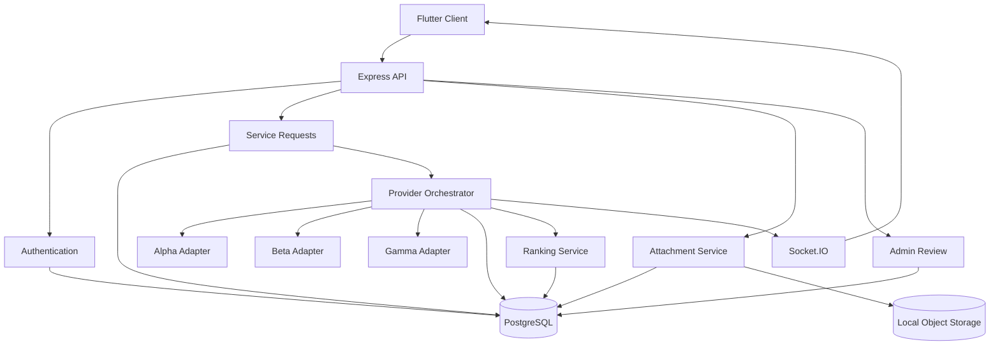

## Architecture



That diagram also helps you explain the system during review.

---

# 11.13 README sections

Your final README should have approximately:

```text
# Relay Backend

## Overview

## Technology Stack

## Architecture

## Core Flow

## Project Structure

## Prerequisites

## Environment Variables

## Running Locally

## Running with Docker

## Database Migrations

## Creating an Admin

## API Documentation

## Running Tests

## Authentication Design

## Request Idempotency

## Provider Adapter Architecture

## Provider Failure Handling

## Offer Normalization

## Ranking Strategy

## Attachment Security

## Realtime Authorization

## Admin Corrections & Audit Trail

## Reliability / Concurrency

## Security Considerations

## Known Limitations

## What I Would Improve Before Production

```

## What I Would Improve Before Production

The assessment implementation intentionally prioritizes a clear,
testable architecture within the available time. Before production I
would make the following improvements:

- Replace in-process provider orchestration with a durable job queue
  such as BullMQ/SQS so provider work survives application restarts.
- Implement a transactional outbox for reliable realtime/event
  publication after database commits.
- Replace local attachment storage with S3-compatible object storage,
  using presigned access and lifecycle policies.
- Validate upload magic bytes in addition to MIME type and extension,
  and introduce malware scanning.
- Introduce refresh-token family tracking and revoke descendants on
  detected refresh-token reuse.
- Use Redis-backed distributed rate limiting for multiple API replicas.
- Add provider-specific circuit breakers, exponential backoff with
  jitter, metrics, and tracing.
- Introduce distributed locking or queue-level uniqueness for request
  processing across multiple workers.
- Store provider API secrets in a managed secret store rather than
  deployment environment files.
- Add structured logging with request correlation IDs and centralized
  monitoring.
- Add retention/redaction policies for customer profile and provider
  diagnostic data.
- Expand load, security, contract, and failure-injection testing.
